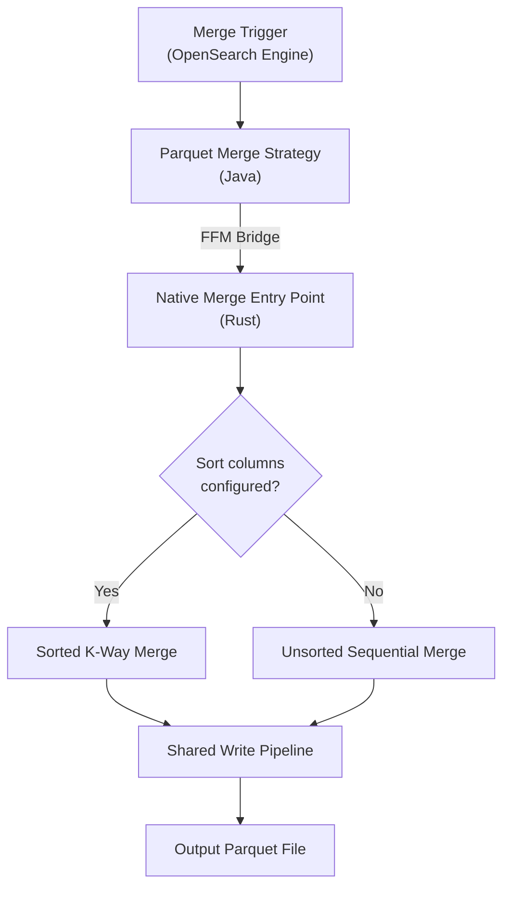
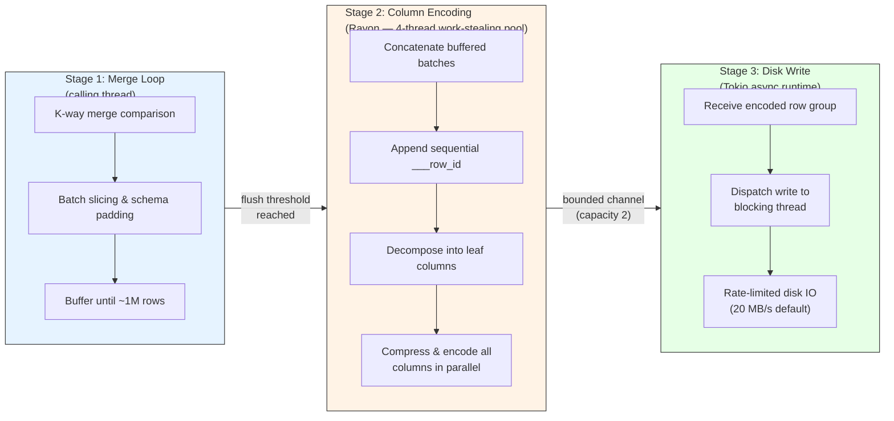
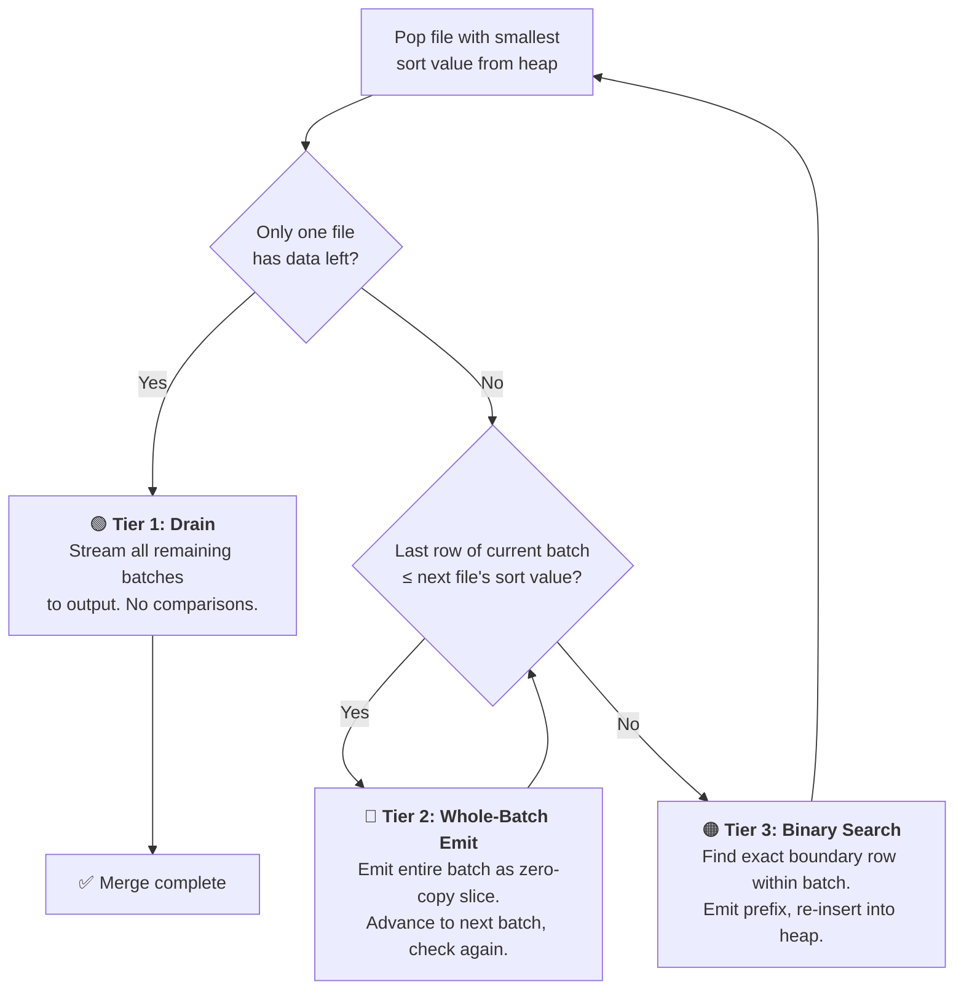
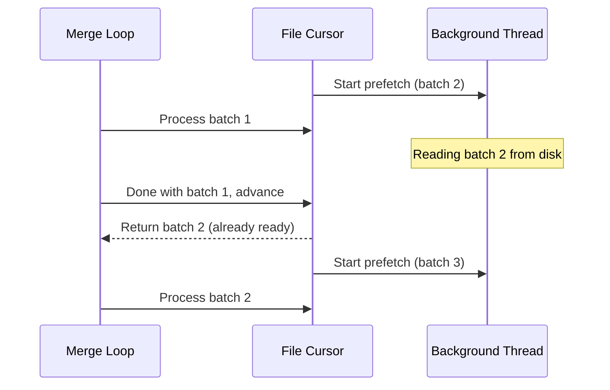
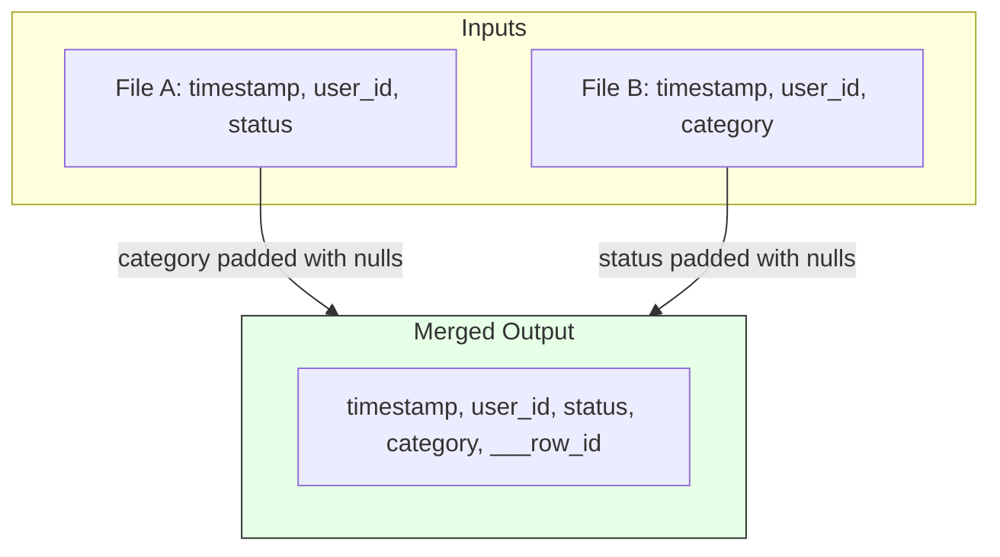

### Is your feature request related to a problem? Please describe

When the Parquet data format plugin accumulates multiple segment files during indexing, there is no mechanism to merge them into a single globally-sorted file. This causes read amplification (every search opens N files), storage overhead (redundant metadata per file), and breaks the global index sort invariant required by `index.sort.*` settings.

### Describe the solution you'd like

## Pre-Read

- [[RFC] OpenSearch Execution Engine #18416](https://github.com/opensearch-project/OpenSearch/issues/18416) — Extensible execution engine architecture, including row ID design across data formats
- [[RFC] Merge support across multiple data formats #19490](https://github.com/opensearch-project/OpenSearch/issues/19490) — Cross-format merge orchestration that triggers this Parquet-specific merge
- [[RFC] Query planning and execution for multiple data formats #18847](https://github.com/opensearch-project/OpenSearch/issues/18847) — Query execution across data sources joined by row ID

---

## 1. Overview

This RFC proposes a streaming k-way merge for the Parquet data format plugin. Given N pre-sorted Parquet segment files, it produces a single output file that:

- Maintains the global sort order defined by `index.sort.field` / `index.sort.order` / `index.sort.missing`
- Assigns globally sequential `___row_id` values for cross-format joins ([#18416](https://github.com/opensearch-project/OpenSearch/issues/18416))
- Handles schema evolution across inputs (union schema with null padding for missing columns)
- Respects user-configured Parquet writer properties (compression, page size, bloom filters)
- Bounds memory independent of input size
- Rate-limits disk writes to avoid starving concurrent indexing

The merge is implemented in Rust and invoked from Java via the Foreign Function and Memory (FFM) API.

---

## 2. Merge Flow

The merge is triggered by OpenSearch's merge orchestration layer ([#19490](https://github.com/opensearch-project/OpenSearch/issues/19490)). The Java layer implements the `Merger` interface via a strategy pattern, resolves sort configuration and writer properties from index settings, and delegates to native Rust code. On failure, the Java layer cleans up any partial output file.

When sort columns are configured, the sorted path performs a k-way merge preserving global order. When no sort columns are configured, files are concatenated sequentially. Both paths share the same write pipeline.

---

## 3. Why Streaming?

A simple approach to merging sorted files would be to read all inputs into memory, sort, and write the output. This works for small segments but breaks down at scale — merging ten 1 GB files would require 10 GB of memory just for the input data, plus additional memory for sorting and output buffering.

The streaming approach reads each input file one batch at a time (default 100K rows), merges them on the fly, and writes the output incrementally. At no point is more than a small window of each file resident in memory. This makes the merge's memory footprint independent of total input size — merging 10 GB uses the same ~300 MB as merging 100 GB.

The streaming design also enables pipelining: while the merge loop is comparing rows from the current batches, the next batch is being prefetched from disk, the previous row group's columns are being compressed in parallel, and the row group before that is being written to disk — all concurrently.

## 4. Pipelined Write Architecture

The write path is split into three concurrent stages so that merge computation, column encoding, and disk IO overlap in time.

### Stage 1 — Merge Loop (calling thread)

The k-way merge algorithm runs on the thread that initiated the merge. It produces Arrow record batch slices, pads them to the union schema (inserting null columns for missing fields), and buffers them in memory. When approximately 1 million rows have accumulated, it triggers a flush to Stage 2.

### Stage 2 — Parallel Column Encoding (Rayon)

Column encoding is the most CPU-intensive part of the write path — each column must be dictionary-encoded, compressed (LZ4, ZSTD, etc.), and packed into the Parquet page format. A single-threaded approach would serialize this work across all columns.

We use [Rayon](https://github.com/rayon-rs/rayon), a work-stealing thread pool, to encode all columns in parallel. When a flush is triggered:

1. All buffered batches are concatenated into a single large batch
2. A sequential `___row_id` column is appended
3. The batch is decomposed into individual leaf column arrays
4. Each (column array, column writer) pair is submitted to the Rayon pool
5. All columns are compressed and encoded concurrently across 4 threads

For a 20-column schema, this means 20 independent encoding tasks distributed across 4 threads via work-stealing — columns that compress quickly finish first and their threads immediately pick up remaining work, naturally load-balancing across columns of varying complexity.

The Rayon pool is initialized once per process and shared across all concurrent merge operations. This bounds total CPU usage for column encoding regardless of how many merges run simultaneously.

### Stage 3 — Background Disk Write (Tokio)

Disk writes are inherently blocking operations that would stall the merge loop if done synchronously. We use a [Tokio](https://tokio.rs/) async runtime to run disk writes in the background:

1. Encoded row groups are sent over a bounded channel (capacity 2) to a background task
2. The background task dispatches each write to a blocking thread (so the async runtime isn't stalled)
3. The write goes through a rate-limited wrapper that enforces a throughput ceiling (default 20 MB/s)

The key optimization: the background task does **not** wait for the current disk write to complete before accepting the next row group. It holds a handle to the in-flight write and only awaits it when the next row group arrives. This means the disk write for row group N happens concurrently with the encoding of row group N+1 — true pipeline parallelism between Stage 2 and Stage 3.

The Tokio runtime is also initialized once per process (4 worker threads) and shared across all merges.

### Backpressure and Rate Limiting

The bounded channel (capacity 2) between Stage 2 and Stage 3 acts as a natural backpressure mechanism. At most 2 encoded row groups can be queued — one being written to disk, one waiting. If the merge loop produces row groups faster than disk can absorb them, the channel fills and the merge loop blocks. This prevents unbounded memory growth without any explicit memory tracking or accounting.

Rate limiting wraps the output file handle and enforces a configurable throughput ceiling. It tracks bytes written since the last pause, and when enough bytes have accumulated, it sleeps for the appropriate duration to maintain the target rate. This prevents merge IO from saturating disk bandwidth and starving concurrent indexing writes on shared storage — critical in production environments where merges run alongside active indexing.

---

## 5. K-Way Merge — Three-Tier Cascade

The core merge algorithm uses a min-heap to always identify which input file has the globally smallest current sort value. A naive implementation would extract and compare sort keys for every single row across all files. The three-tier cascade optimizes this by choosing the coarsest granularity possible for each step.

Each input file is read in batches of 100K rows. The heap contains one entry per active file, holding that file's current row's sort value. The algorithm pops the smallest entry, then decides how much data to emit from that file before returning to the heap:

### Tier 1 — Single Cursor Drain

**When it fires:** All input files except one have been fully consumed.

**What it does:** The remaining file's batches are streamed directly to the output — no sort key extraction, no comparison, no heap operations. Each batch is sliced from the current position to the end, padded to the union schema, and pushed to the write pipeline.

**Why it matters:** In many real-world merges, one file is significantly larger than the others (e.g., a large existing segment being merged with several small recently-flushed segments). Once the small files are exhausted, the large file's remaining data — potentially millions of rows — flows through with zero comparison overhead. This is the terminal state of every merge.

### Tier 2 — Whole-Batch Emit

**When it fires:** Multiple files are active, and the last row of the current file's batch has a sort value that is still ≤ the heap top (the smallest sort value among all other files).

**What it does:** The entire remaining portion of the current batch is emitted as a single zero-copy Arrow slice — no data is copied, just an offset and length adjustment on the underlying buffer. The cursor advances to the next batch and the check repeats. A single file can emit many consecutive batches in Tier 2 before yielding back to the heap.

**Why it matters:** This is the dominant tier when input files have non-overlapping or minimally-overlapping sort ranges. Since each segment file was typically written during a different time window, their sort ranges often don't overlap at all. In this case, the merge degenerates to batch-level interleaving: one comparison per 100K-row batch instead of 100K individual comparisons. The merge essentially becomes "copy file A's batches, then file B's batches" with minimal overhead.

### Tier 3 — Binary Search Boundary

**When it fires:** The current batch partially overlaps with the heap top — some rows belong before the heap top, others belong after it.

**What it does:** A binary search within the batch finds the exact boundary row — the last row whose sort value is ≤ the heap top. The rows up to and including the boundary are emitted as a slice. The cursor advances past the boundary, and the file is re-inserted into the heap with its new sort value at the advanced position.

**Why it matters:** Instead of scanning all rows in the batch to find the boundary (O(B) where B = batch size), the binary search finds it in O(log₂ B) sort key extractions. For a 100K-row batch, that's ~17 extractions instead of 100K. Each extraction reads one value per sort column from the Arrow columnar array — a single indexed memory access.

### Performance Summary

| Scenario | Dominant Tier | Sort key work per 100K rows |
|----------|--------------|--------------------------|
| Non-overlapping time ranges (common) | Tier 2 → Tier 1 | ~1 comparison |
| Partially overlapping ranges | Tier 2 + Tier 3 | ~17 comparisons at boundaries |
| Single large file + small files | Tier 1 after small files drain | 0 |
| Fully interleaved data (worst case) | Tier 3 | ~17 comparisons per boundary |

---

## 6. Sort Key Types

The merge supports all sort field types allowed by OpenSearch's `IndexSortConfig`:

| OpenSearch Type | Lucene SortField.Type | Sort Key | Comparison |
|---|---|---|---|
| `long`, `date`, `date_nanos` | LONG | 64-bit integer | Standard integer ordering |
| `integer`, `short`, `byte` | INT | 64-bit integer (widened) | Standard integer ordering |
| `double` | DOUBLE | 64-bit float | IEEE 754 total ordering (handles -0.0, NaN) |
| `float`, `half_float` | FLOAT | 64-bit float (widened) | IEEE 754 total ordering |
| `keyword` | STRING | UTF-8 byte array | Byte-level lexicographic (matches Lucene's BytesRef) |

Null values use explicit null-first / null-last representations rather than sentinel values, eliminating any risk of collision with real data. OpenSearch defaults to nulls-last regardless of sort direction, and the merge preserves this.

Multi-column sort is supported with per-column ascending/descending direction.

---

## 7. File Cursor with Prefetch

Each input file is wrapped in a cursor that reads batches sequentially and prefetches the next batch in the background while the merge loop processes the current one.

This overlaps disk IO with merge computation. For IO-bound merges on slow storage, it effectively hides read latency.

Each cursor also returns its schema on construction, so the union schema can be built without re-opening any file. Each input file is opened exactly once.

---

## 8. Schema Evolution and Row ID Rewrite

Input files may have different column sets due to mapping changes between segments:

The union schema is computed once during initialization. Batches from files missing a column get a null-filled array inserted. When all files share the same schema (the common case), batches pass through with no copy.

The `___row_id` column is stripped from all inputs and rewritten with globally sequential values `[0, total_rows)` during each row group flush, ensuring a clean contiguous ID space for cross-format joins ([#18416](https://github.com/opensearch-project/OpenSearch/issues/18416)).

---

## 9. Writer Sort-on-Finalize

The merge module is also used when individual segment files are finalized. Accumulated unsorted data must be sorted before the file is ready for queries:

- **Small files (≤ 32 MB):** In-memory sort using Arrow's built-in lexicographic sort
- **Large files (> 32 MB):** External merge sort — each batch is sorted individually and written as a temporary chunk file, then the k-way merge combines all chunks into the globally-sorted output

This bounds memory to a single batch regardless of total file size.

---

## 10. Memory and Threading

**Memory** is bounded independent of input size:

| Component | Bounded by |
|-----------|-----------|
| File cursors (per input) | 2 batches × batch size × N files |
| Output buffer | Flush threshold (~1M rows) |
| IO channel | 2 compressed row groups |

With defaults and a typical 10-column schema, peak memory is ~300-350 MB whether merging 10 GB or 100 GB.

**Threading** uses two process-wide shared pools:

| Pool | Threads | Purpose |
|------|---------|---------|
| Encoding pool | 4 | Parallel column compression and encoding |
| IO runtime | 4 workers | Background disk writes |
| Calling thread | 1 per merge | Merge loop, batch slicing, schema padding |

The pools are shared across all concurrent merges, preventing thread count explosion.

---

## 11. Known Limitations and Future Work

**Current limitations:**
- Rate limit, thread counts, batch size, and flush threshold are compile-time constants (should be configurable via index settings)
- Mid-merge failure leaves a partial output file (Java layer cleans up, but atomic temp-file-then-rename at the native level would be more robust)
- `unsigned_long` is not supported as a sort type (also not supported by OpenSearch's `IndexSortConfig`)

**Future work:**
- Configurable tuning parameters via index settings
- Structured merge metrics for observability (rows/sec, bytes written, pipeline stage time breakdown)
- Adaptive rate limiting based on real-time IO pressure
- Atomic output file writes

### Related component

Indexing

### Describe alternatives you've considered

**Row-by-row merge without batch optimization:** Correct but significantly slower. The three-tier cascade avoids per-row work in the common case of non-overlapping sort ranges.

**Single-threaded write path:** Simpler but leaves performance on the table. Parallel column encoding and pipelined disk writes are critical for throughput on multi-core hardware with high-latency storage.

**Java-only merge using Arrow Java:** Avoids FFM bridge complexity but sacrifices the performance benefits of Rust's parallel encoding, work-stealing thread pool, and fine-grained memory control.

### Additional context

- PR: https://github.com/opensearch-project/OpenSearch/pull/21079
- Related: [#19490](https://github.com/opensearch-project/OpenSearch/issues/19490) — Merge support across multiple data formats
- Related: [#18416](https://github.com/opensearch-project/OpenSearch/issues/18416) — OpenSearch Execution Engine
- Related: [#18847](https://github.com/opensearch-project/OpenSearch/issues/18847) — Query planning and execution for multiple data formats
