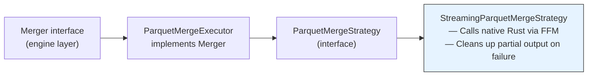
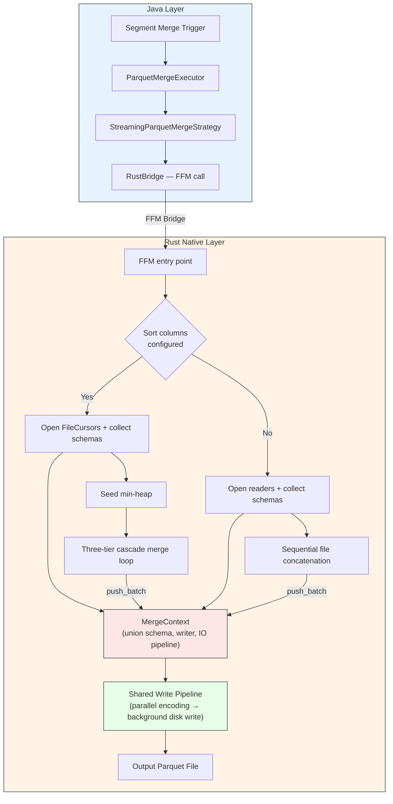
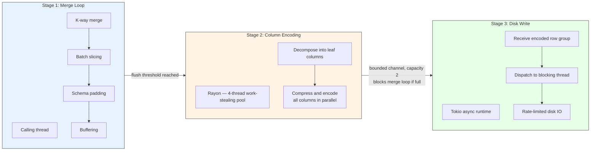
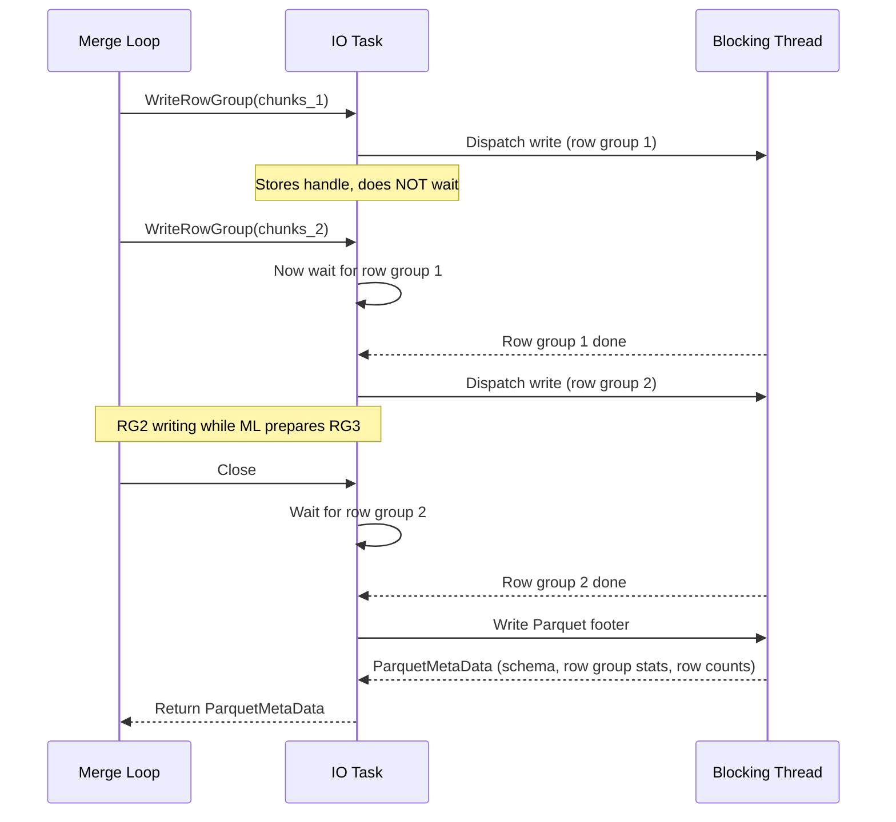
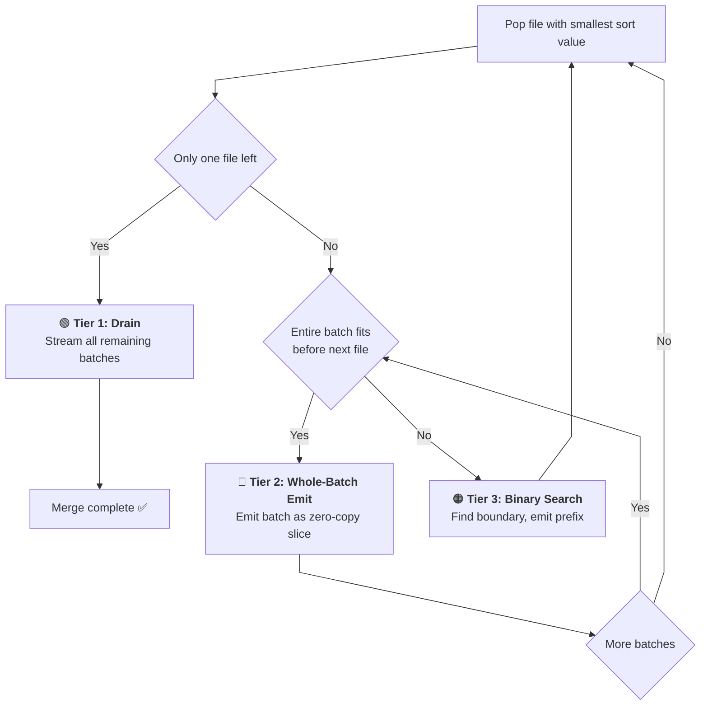
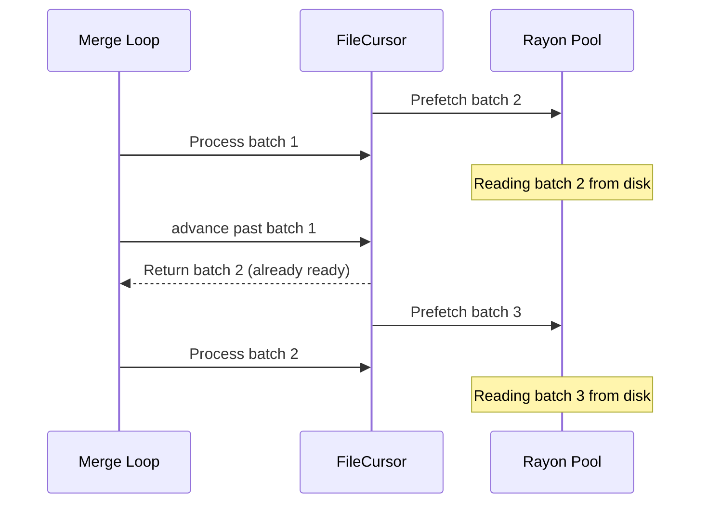

# RFC: Streaming K-Way Merge for Parquet Data Format in OpenSearch

## Related RFCs

- [[RFC] OpenSearch Execution Engine #18416](https://github.com/opensearch-project/OpenSearch/issues/18416) — Extensible execution engine architecture, row ID design
- [[RFC] Merge support across multiple data formats #19490](https://github.com/opensearch-project/OpenSearch/issues/19490) — Cross-format merge orchestration
- [[RFC] Query planning and execution for multiple data formats #18847](https://github.com/opensearch-project/OpenSearch/issues/18847) — Query execution across data sources joined by row ID

---

## 1. Summary

This RFC describes the design and implementation of a streaming k-way merge system for the Parquet data format plugin in OpenSearch. The system merges multiple sorted Parquet segment files into a single globally-sorted output file while preserving index sort order, handling schema evolution across inputs, rewriting synthetic row identifiers, and bounding memory usage independent of input size. The merge is implemented entirely in Rust and invoked from Java via the Foreign Function and Memory (FFM) API.

---

## 2. Problem Statement

OpenSearch's pluggable indexing framework requires each data format to implement its own segment merge strategy. During normal indexing operations, the engine accumulates multiple small Parquet segment files. Without a merge operation:

- **Read amplification grows linearly** with segment count — every search must open and scan N files
- **Storage overhead increases** due to redundant column metadata, dictionaries, and Parquet footers per file
- **Index sort invariants break** — each file is internally sorted, but there is no global sort order across files
- **Row ID space fragments** — the synthetic `___row_id` column (used for cross-format joins as defined in [#18416](https://github.com/opensearch-project/OpenSearch/issues/18416)) must be globally sequential in the merged output

The merge system must satisfy these requirements:
1. Combine N input Parquet files into one output file
2. Preserve the index sort order defined by `index.sort.field` / `index.sort.order` / `index.sort.missing`
3. Assign globally sequential `___row_id` values `[0, total_rows)` across the merged output
4. Handle schema evolution — input files may have different column sets (union schema with null padding)
5. Respect user-configured Parquet writer properties (compression codec, page size, bloom filters, dictionary size)
6. Bound memory usage regardless of input size — no full materialization of any input file
7. Minimize IO impact on concurrent indexing operations via rate limiting

---

## 3. Architecture Overview

### 3.1 Java Layer — Strategy Pattern

The merge is triggered by OpenSearch's merge orchestration layer ([#19490](https://github.com/opensearch-project/OpenSearch/issues/19490)). The Parquet plugin implements the `Merger` interface via a strategy pattern:



The strategy pattern allows swapping merge implementations (e.g., for testing or future alternative strategies) without changing the engine integration.

### 3.2 End-to-End Flow



Sort configuration and writer properties (compression, page size, bloom filters) are stored in a process-wide settings store keyed by index name. Writer creation stores sort configuration alongside writer properties. The merge operation reads these back by index name, ensuring the output file gets identical encoding settings.

### 3.3 Rust Module Structure

```
merge/
├── mod.rs          Public API exports
├── context.rs      MergeContext — shared state for both merge paths
├── sorted.rs       K-way merge with three-tier cascade optimization
├── unsorted.rs     Sequential file concatenation (no sort columns)
├── cursor.rs       FileCursor — per-file positioned reader with prefetch
├── heap.rs         SortKey enum, HeapItem, comparison functions
├── schema.rs       Union schema building, row ID append, batch padding
├── io_task.rs      Background IO pipeline (Tokio runtime + Rayon pool)
└── error.rs        MergeError enum with Arrow/Parquet/IO/Logic variants
```

---

## 4. Detailed Design

### 4.1 MergeContext — Unified Merge State Machine

`MergeContext` is the central abstraction that owns all shared state for a merge operation. It eliminates code duplication between the sorted and unsorted merge paths by encapsulating schema construction, writer setup, buffering, parallel encoding, and IO task management.

**State owned by MergeContext:**

| Field | Type | Purpose |
|-------|------|---------|
| `data_schema` | `Arc<ArrowSchema>` | Union of all input schemas (excluding `___row_id`) |
| `output_schema` | `Arc<ArrowSchema>` | `data_schema` + appended `___row_id` INT64 column |
| `rg_writer_factory` | `ArrowRowGroupWriterFactory` | Creates per-row-group column writers for parallel encoding |
| `io_tx` | `tokio_mpsc::Sender<IoCommand>` | Channel to the background IO task |
| `output_chunks` | `Vec<RecordBatch>` | Buffered batches awaiting flush |
| `output_flush_rows` | `usize` | Threshold that triggers a flush (default 1,000,000 rows) |
| `next_row_id` | `i64` | Next sequential row ID to assign |

**Lifecycle:** `new()` validates the output directory, computes the union Arrow schema across all inputs, builds the output schema (data + `___row_id`), opens the output file with a rate-limited writer, loads writer properties from the settings store, creates the Parquet file writer and row group factory, and spawns the background IO task. After initialization, the sorted or unsorted merge loop calls `push_batch()` repeatedly — batches accumulate until the flush threshold is reached, triggering `flush()` which concatenates, appends row IDs, encodes columns in parallel, and sends the encoded row group to the IO task. When all data is pushed, `finish()` performs a final flush and closes the IO task, which writes the Parquet footer and returns the file metadata (schema, row group statistics, row counts).

**Why concat before encoding:** Parquet row groups should contain ~1M rows for optimal read performance (column chunk statistics, predicate pushdown granularity). The merge loop produces many small slices (especially in Tier 3). Concatenating them into a single large batch before encoding ensures each row group is appropriately sized, and the parallel column encoding has enough work per column to amortize thread scheduling overhead.

### 4.2 Three-Stage IO Pipeline

The write path is decomposed into three concurrent stages to maximize throughput:



**Stage 1 — Merge Loop (calling thread):** The k-way merge algorithm runs on the thread that called `merge_sorted()`. It produces `RecordBatch` slices, pads them to the union schema, and pushes them into `MergeContext`. When the buffer threshold is reached, it triggers a flush.

**Stage 2 — Parallel Column Encoding (Rayon):** Column encoding is the most CPU-intensive part of the write path — each column must be dictionary-encoded, compressed (LZ4, ZSTD, etc.), and packed into the Parquet page format. We use [Rayon](https://github.com/rayon-rs/rayon), a work-stealing thread pool, to encode all columns in parallel. For a 20-column schema, all 20 columns are distributed across 4 threads — columns that compress quickly finish first and their threads immediately pick up remaining work, naturally load-balancing across columns of varying complexity. The Rayon pool is process-wide and shared across all concurrent merge operations, bounding total CPU usage.

**Stage 3 — Background Disk Write (Tokio):** Disk writes are inherently blocking operations that would stall the merge loop if done synchronously. We use a [Tokio](https://tokio.rs/) async runtime to run disk writes in the background. The IO task implements a single-flight write pattern:



The key insight: the disk write for row group N happens concurrently with the encoding of row group N+1 — true pipeline parallelism between Stage 2 and Stage 3.

**Backpressure:** The bounded channel (capacity 2) between Stage 2 and Stage 3 means at most 2 encoded row groups can be queued. If the merge loop produces row groups faster than disk can absorb them, the channel fills and the merge loop blocks — naturally throttling the pipeline without unbounded memory growth.

**Error recovery:** If the IO task encounters a write error, it enters a drain mode — it consumes all remaining commands from the channel and responds to the close command with the original error. This ensures the merge caller never hangs.

### 4.3 Rate-Limited Writer

All merge output goes through `RateLimitedWriter<File>`, which wraps the output file and enforces a configurable throughput ceiling (default 20 MB/s).

The algorithm tracks bytes written since the last pause. When enough bytes accumulate (calculated as 20ms worth of data at the configured rate, capped at 1MB), it computes the target time for that volume, compares against elapsed wall time, and sleeps for the difference if writing is ahead of schedule.

Merge operations can produce sustained sequential write bursts of hundreds of MB. On shared storage (EBS, NFS), this can saturate IO bandwidth and starve concurrent indexing writes. The rate limit ensures merges make steady progress without monopolizing disk IO.

The rate is dynamically adjustable (protected by `RwLock`), though not yet exposed through settings. This 20 MB/s value is currently hardcoded and not configurable via index settings — it should be made configurable in a follow-up. Lock poisoning is handled gracefully — rate limiting is skipped rather than panicking.

### 4.4 K-Way Merge Algorithm — Three-Tier Cascade

The sorted merge uses a min-heap (via `BinaryHeap` with reversed `Ord`) to always process the cursor with the globally smallest current sort value. The algorithm is optimized with a three-tier cascade that minimizes per-row sort key extraction and comparison.

Each input file gets a `FileCursor`. The first row's sort values are extracted from each cursor and pushed into the heap. The `reverse_sorts` vector is wrapped in `Arc` and shared across all heap items — a single allocation for the entire merge.

The main loop pops the smallest entry, then decides how much data to emit from that file before returning to the heap:



#### Tier 1 — Single Cursor Drain

**When it fires:** All input files except one have been fully consumed.

**What it does:** The remaining file's batches are streamed directly to the output — no sort key extraction, no comparison, no heap operations. Each batch is sliced from the current position to the end, padded to the union schema, and pushed to the write pipeline.

**Why it matters:** In many real-world merges, one file is significantly larger than the others (e.g., a large existing segment being merged with several small recently-flushed segments). Once the small files are exhausted, the large file's remaining data — potentially millions of rows — flows through with zero comparison overhead. This is the terminal state of every merge.

#### Tier 2 — Whole-Batch Emit

**When it fires:** Multiple files are active, and the last row of the current file's batch has a sort value that is still ≤ the heap top (the smallest sort value among all other files).

**What it does:** The entire remaining portion of the current batch is emitted as a single zero-copy Arrow slice — no data is copied, just an offset and length adjustment on the underlying buffer. The cursor advances to the next batch and the check repeats. A single file can emit many consecutive batches in Tier 2 before yielding back to the heap.

**How it works:**
1. Extract sort values of the last row in the current batch
2. Compare against the heap top
3. If `last_val <= heap_top`: the entire batch fits before any other cursor's current position
4. Emit as a zero-copy slice
5. Advance to next batch — if next batch also fits, repeat (stay in Tier 2)

**Why this is the common case:** When input files have non-overlapping or minimally-overlapping sort ranges (which is typical — each file was written during a different time window), most batches will pass the Tier 2 check. The merge degenerates to batch-level interleaving rather than row-level merging. One comparison per 100K-row batch instead of 100K individual comparisons.

#### Tier 3 — Binary Search Boundary

**When it fires:** The current batch partially overlaps with the heap top — some rows belong before the heap top, others belong after it.

**What it does:** A binary search within the batch finds the exact boundary row — the last row whose sort value is ≤ the heap top. The rows up to and including the boundary are emitted as a slice. The cursor advances past the boundary, and the file is re-inserted into the heap with its new sort value at the advanced position.

**Algorithm:**
1. `lo = current_row_idx`, `hi = batch_height - 1`
2. Binary search: for each `mid`, extract sort values and compare against heap top
   - If `mid_val <= heap_top`: `lo = mid` (this row can be emitted)
   - If `mid_val > heap_top`: `hi = mid` (this row must wait)
3. Emit rows `[run_start .. run_end]` (inclusive) as a slice, where `run_len = run_end - run_start + 1`
4. Advance cursor past the boundary
5. If the new position's sort value exceeds the heap top, re-insert into heap and break
6. Otherwise, continue the inner loop (more rows may still fit)

**Why it matters:** Instead of scanning all rows in the batch to find the boundary (O(B) where B = batch size), the binary search finds it in O(log₂ B) sort key extractions. For a 100K-row batch, that's ~17 extractions instead of 100K. Each extraction reads one value per sort column from the Arrow columnar array — a single indexed memory access.

#### Performance Summary

| Scenario | Dominant Tier | Sort key work per 100K rows |
|----------|--------------|--------------------------|
| Non-overlapping time ranges (common) | Tier 2 → Tier 1 | ~1 comparison |
| Partially overlapping ranges | Tier 2 + Tier 3 | ~17 comparisons at boundaries |
| Single large file + small files | Tier 1 after small files drain | 0 |
| Fully interleaved data (worst case) | Tier 3 | ~17 comparisons per boundary |

*Note: Each "comparison" involves extracting sort values for all sort columns. For multi-column sorts with string (`keyword`) columns, each extraction allocates a byte array. With 3 sort columns including a keyword field, a single Tier 3 boundary costs ~17 × 3 = 51 extractions, some with heap allocation.*

### 4.5 Sort Key Type System

Sort values are extracted from Arrow columnar arrays into a `SortKey` enum that supports all five Lucene `SortField.Type` values allowed by OpenSearch's `IndexSortConfig.ALLOWED_INDEX_SORT_TYPES`:

```rust
pub enum SortKey {
    NullFirst,
    NullLast,
    Int(i64),
    Float(f64),
    Bytes(Vec<u8>),
}
```

| OpenSearch Field Type | Lucene SortField.Type | SortKey Variant | Notes |
|---|---|---|---|
| `long`, `date`, `date_nanos` | LONG | `Int(i64)` | Direct value / epoch millis / nanos |
| `integer`, `short`, `byte` | INT | `Int(i64)` | Widened to i64 |
| `double` | DOUBLE | `Float(f64)` | Compared via `f64::total_cmp` (IEEE 754 total order) |
| `float` | FLOAT | `Float(f64)` | Widened to f64 |
| `keyword` | STRING | `Bytes(Vec<u8>)` | UTF-8 byte-level lexicographic (matches Lucene's `BytesRef.compareTo`) |

**Null handling** uses explicit `NullFirst` / `NullLast` variants rather than sentinel values (`i64::MIN` / `i64::MAX`), eliminating any risk of collision with real data values. OpenSearch defaults to nulls-last regardless of sort direction.

**Multi-column sort** is supported with per-column ascending/descending direction. `cmp_sort_values()` performs lexicographic comparison across the sort key tuple, applying per-column reversal. `HeapItem::Ord` delegates to the same function with swapped arguments to achieve min-heap behavior — single source of truth for comparison logic.

### 4.6 FileCursor — Positioned Reader with Prefetch

Each input file is wrapped in a `FileCursor` that provides projection (strips `___row_id`), configurable batch size (default 100K rows), sort column resolution at construction, and background prefetch.



The prefetch uses a bounded channel (capacity 1) — at most one batch is prefetched ahead. This overlaps disk IO with merge computation, effectively hiding read latency for IO-bound merges.

**Tradeoff:** Prefetch tasks run on the same Rayon pool used for column encoding (4 threads shared). In practice this is fine because prefetch is typically kicked off between flushes when encoding isn't running. Even when they overlap, the prefetch task mostly waits on disk IO while the other threads encode columns. A dedicated IO thread for prefetch would avoid any contention but would add complexity for minimal gain.

`FileCursor::new()` returns the cursor, projected Arrow schema, and Parquet schema descriptor. The caller uses these to build union schemas without re-opening any file — each input file is opened exactly once.

### 4.7 Schema Handling

**Union schema:** Input files may have different column sets due to mapping changes. `ArrowSchema::try_merge()` computes the union, validating type compatibility. `build_parquet_root_schema()` collects unique field names via `HashSet` (O(1) dedup) and appends a fresh `___row_id` column.

**Batch padding:** When a batch is missing a column present in the union, a null-filled array of the correct type is inserted. When schemas already match (common case), the batch passes through with no copy.

**Row ID rewrite:** The `___row_id` column is stripped from all inputs via projection and rewritten with globally sequential values `[0, total_rows)` during each row group flush, ensuring a clean contiguous ID space for cross-format joins ([#18416](https://github.com/opensearch-project/OpenSearch/issues/18416)).

### 4.8 Unsorted Merge Path

When no sort columns are configured, files are concatenated sequentially in a single pass: collect schemas and build readers simultaneously (no double-open), create `MergeContext` with union schema, iterate each reader, pad batches, push through the same pipeline. No heap, no sort key extraction, no comparison.

### 4.9 Writer Integration — Sort-on-Finalize

The merge module is also used during individual segment file finalization. Accumulated unsorted data must be sorted according to `index.sort.*` settings:

- **Small files (≤ 32MB):** In-memory sort using Arrow's built-in `lexsort_to_indices`
- **Large files (> 32MB):** External merge sort — each batch sorted individually, written as a temp chunk file, then the k-way merge combines all chunks into the globally-sorted output

Both paths use the actual index settings from the settings store for writer properties.

---

## 5. Error Handling

**Rust error type:** `MergeError` enum with `Arrow`, `Parquet`, `Io`, and `Logic` variants. Automatic conversions from each underlying error type allow errors to propagate cleanly through the entire merge module without manual conversion at each call site.

**IO task recovery:** On write failure, the IO task drains remaining commands and responds to the close command with the original error — the merge caller never hangs.

**Java-side cleanup:** `StreamingParquetMergeStrategy` wraps the native call in a try-catch, deletes any partial output file on failure, and re-throws.

---

## 6. Memory Bounds

| Component | Bounded by |
|-----------|-----------|
| File cursors (per input) | 2 batches × batch size × N files |
| Output buffer | Flush threshold (~1M rows) |
| Column encoding | One row group during parallel encoding |
| IO channel | 2 compressed row groups |
| Heap | N files × sort key size |

**Example calculation** for a typical 10-column schema at ~100 bytes/row with 10 input files, default settings (100K batch size, 1M flush threshold):

- Output buffer: 1M rows × 100 bytes = **~100 MB**
- Cursor batches: 2 × 100K × 100 bytes × 10 files = **~200 MB**
- IO channel: 2 compressed row groups ≈ **~20-50 MB** (depends on compression ratio)
- Heap: negligible (10 entries × sort key size)
- **Total: ~320-350 MB peak**, independent of total input size

**Note on string sort columns:** When sort columns include `keyword` fields, each sort key extraction allocates a `Vec<u8>` for the string bytes. In Tier 3 binary search, this means ~17 allocations per boundary per sort column. For keyword fields with long values (e.g., URLs), this adds allocation pressure proportional to string length × number of binary search steps. For the common case of short keywords (5-50 bytes), this is negligible.

---

## 7. Thread Model

| Pool | Threads | Name | Purpose | Lifetime |
|------|---------|------|---------|----------|
| Calling thread | 1 | (inherited) | K-way merge loop | Per merge |
| Rayon | 4 | `parquet-merge-{0-3}` | Parallel column encoding (CPU-bound) | Process-wide |
| Rayon (shared) | ↑ same pool | ↑ same threads | Cursor prefetch IO (IO-bound) | Process-wide |
| Tokio | 4 workers | `parquet-io` | Background disk writes | Process-wide |
| Tokio blocking | dynamic | (default) | Actual write syscalls | Per row group |

Column encoding and cursor prefetch share the same 4-thread Rayon pool. This is a deliberate tradeoff — prefetch tasks are IO-bound (waiting on disk) while encoding is CPU-bound (compression). They rarely contend in practice because prefetch runs between flushes, but under heavy load they compete for the same threads.

---

## 8. Testing

- **Unit tests:** Sort value extraction for all supported types, schema building, batch padding, null handling
- **Merge integration tests:** End-to-end sorted and unsorted merges, schema evolution, ascending/descending/mixed sort directions
- **Sort type tests:** All supported sort column types including float NaN, empty strings, null-first vs null-last
- **Java tests:** Writer lifecycle, sort-on-finalize, VectorSchemaRoot rotation
